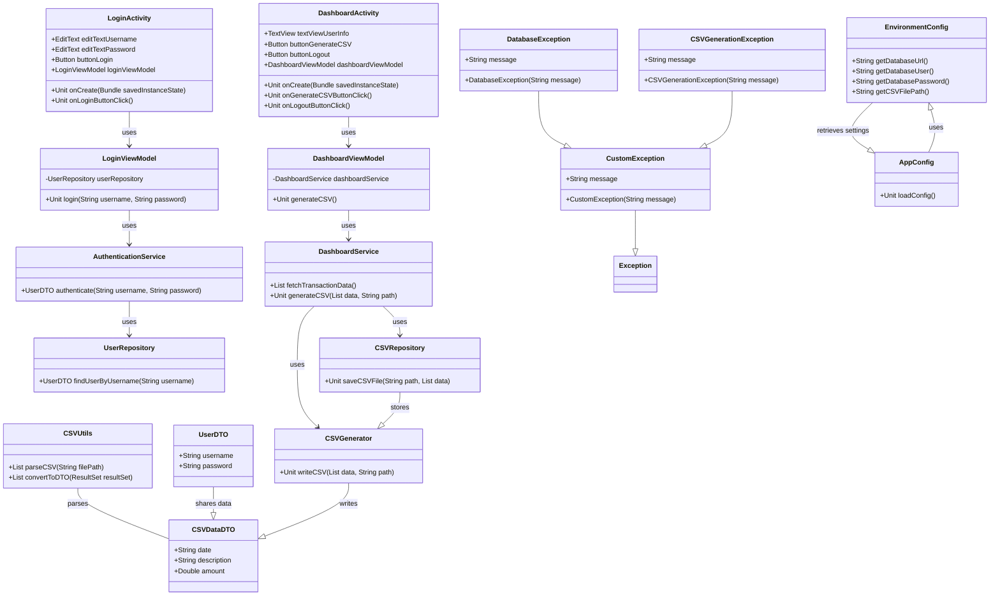

# Sistema de Login com Dashboard

Este projeto é um exemplo de aplicação Android desenvolvida em Kotlin que demonstra a implementação de um sistema de login com um dashboard. A aplicação utiliza princípios de programação orientada a objetos (POO), design patterns e boas práticas de desenvolvimento de software.

## Resumo

A aplicação é composta por um sistema de autenticação de usuários, onde os usuários podem fazer login e acessar um dashboard com informações geradas a partir de dados de um arquivo CSV. A arquitetura do sistema é modular, com foco em robustez, manutenção e escalabilidade.

### Funcionalidades

- **Tela de Login:** Permite que os usuários entrem com suas credenciais.
- **Dashboard:** Exibe informações extraídas e processadas a partir de um arquivo CSV.
- **Geração de CSV:** Cria um arquivo CSV com dados simulados.
- **Log de Erros:** Implementação de logging para monitoramento e depuração.

## Conceitos Aplicados

- **DTO (Data Transfer Object):** Utilizado para transferir dados entre camadas da aplicação.
- **Exceções Personalizadas:** Definição e uso de exceções específicas para a aplicação, como `CustomException`, `DatabaseException` e `CSVGenerationException`.
- **Injeção de Dependência:** Usada para fornecer instâncias de classes e promover um design desacoplado.
- **Logging:** Implementação de `log4j2` para registrar erros e eventos do sistema.
- **Programação Orientada a Objetos:** Aplicação dos princípios de POO, como encapsulamento, herança e polimorfismo.
- **Design Patterns:** Uso de padrões de projeto como Singleton e DAO (Data Access Object).
- **Programação Assíncrona:** Implementação de chamadas de rede e operações de I/O assíncronas para melhorar a performance da aplicação.

## Estrutura de Diretórios

A estrutura de diretórios do projeto é organizada da seguinte forma:

